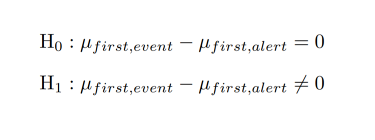

```{r setup, include=FALSE}
knitr::opts_chunk$set(echo = TRUE)
if (!dir.exists("data")) dir.create("data")
```

# Objetivo

El objetivo de esta práctica es realizar un estudio de un seguido de incidentes que han recibido diferentes empresas de distintos sectores para poder determinar quién los ha producido así como investigar de qué manera se han podido realizar para futuras prevenciones. Finalmente, se intentará ver si se pueden, o no, predecir estos.

Para poder llevar a cabo este estudio se dispone de datasets que nos han sido proporcionados. Por un lado, tenemos la información de los incidentes a estudiar i, por otro, la información de un seguido de estándares que nos ayudaran a poder sacar conclusiones sobre los incidentes.

## Datasets
```{r ds_mitre and ds_incidents, echo=TRUE, warning=FALSE, cache=TRUE, results='hide'}
#mitre.data <- readRDS(file = "data/mitredata.rds")
mitre.data <- mitre::getLatestDataSet()
mitre.data$cpe <- list(cpe.nist = mitre.data$cpe$cpe.nist[sample(1000),])
mitre.data$cve <- list(cve.nist = mitre.data$cve$cve.nist[sample(1000),])
mitre.data$mitrenet <- mitre::build_network(standards = mitre.data, as_igraph = F, verbose = F)
incidents <- readRDS(file = "data/incidents.rds")
```

## Standards

Para poder resolver esta práctica, se han estudiado previamente los diferentes estándares con los que más adelante se trabajará para poder sacar conclusiones de los incidentes presentados.   
Los estándares son los que se presentan a continuación. En el link que se proporciona se puede aprender en qué consisten y qué información nos proporcionan.

### CVE 
[https://cve.mitre.org/about/](https://cve.mitre.org/about/)
```{r ds_cve, echo=FALSE, message=FALSE, warning=FALSE}
raw_cves <- mitre.data$cve
```
### CWE
[https://github.com/martavilab/DataDrivenSecurity/blob/main/CWE/CWE.md](https://github.com/martavilab/DataDrivenSecurity/blob/main/CWE/CWE.md)
```{r ds_cwe, echo=FALSE, message=FALSE, warning=FALSE}
raw_cwes <- mitre.data$cwe
```
### ATT&CK
[https://github.com/ivannin49/DataDriven_Attack/blob/main/README.md](https://github.com/ivannin49/DataDriven_Attack/blob/main/README.md")
```{r ds_attck, echo=FALSE, message=FALSE, warning=FALSE}
raw_attck <- mitre.data$attck
```
### SHIELD
[https://shield.mitre.org/](https://shield.mitre.org/)
```{r ds_shield, echo=FALSE, message=FALSE, warning=FALSE}
raw_shield <- mitre.data$shield
```
### CPE
[https://github.com/DanielPulidoSC/DataDrivenSecurity/blob/main/CPE.md](https://github.com/DanielPulidoSC/DataDrivenSecurity/blob/main/CPE.md)
```{r ds_cpe, echo=FALSE, message=FALSE, warning=FALSE}
raw_cpes <- mitre.data$cpe
```
### CAR
[https://github.com/Barbero95/DataDrivenSecurity-CAR](https://github.com/Barbero95/DataDrivenSecurity-CAR)
```{r ds_car, echo=FALSE, message=FALSE, warning=FALSE}
raw_car <- mitre.data$car
```

### CAPEC
[https://github.com/danielorihuela/DataDrivenSecurity/blob/master/capec.md](https://github.com/danielorihuela/DataDrivenSecurity/blob/master/capec.md)

## Packages
Para la realización de este proyecto se usan los siguientes packages de r:
```{r l_p, echo=FALSE, message=FALSE, warning=FALSE}
# ipak function: install and load multiple R packages.
# check to see if packages are installed. Install them if they are not, then load them into the R session.
ipak <- function(pkg){
new.pkg <- pkg[!(pkg %in% installed.packages()[, "Package"])]
if (length(new.pkg)) 
    install.packages(new.pkg, dependencies = TRUE)
sapply(pkg, require, character.only = TRUE)
}
```

```{r load_packages, echo=FALSE, message=FALSE, warning=FALSE, results='hide'}
packages <- c("ggplot2", "dplyr", "tidyr", "tidyverse", "DataExplorer", "ggridges", "hrbrthemes", "viridisLite", "viridis", "readr", "packcircles", "ggiraph", "Hmisc", "kableExtra", "lubridate", "plotly", "data.table", "formattable", "visNetwork", "knitr", "sjmisc", "mitre", "rworldmap", "stringr", "maps", "RJSONIO")
ipak(packages)
pa<-data.table(packages)
cc<-as.integer(length(packages)/3)
pa1<-pa[1:cc]
pa2<- pa[(cc+1):(2*cc)]
pa3<- pa[(2*cc+1):length(packages)]
```
```{r pack, echo=FALSE, message=FALSE, warning=FALSE}
options(knitr.kable.NA = '')
knitr::kable(list(pa1, pa2, pa3),col.names = NULL, caption = "Required:") %>%
    kable_styling(bootstrap_options = c("striped", "condensed"))
```

# Análisis exploratorio de los incidentes

Para poder empezar nuestro estudio, inicialmente se presentará el análisis exploratorio de nuestro dataset incidents para poder ver con qué tipo de información estamos trabajando. 

Antes de empezar, por eso, vemos que tenemos una columna donde tenemos información en forma de matriz de modo que acabamos de arreglar el dataset con el que trabajaremos:


```{r ds_incidents, echo=TRUE, warning=FALSE, cache=TRUE, results='hide'}
incidents <- incidents %>% unnest(mitre_attack)
apply(incidents, 2, function(x) length(unique(x)))
incidents <- incidents %>%
  mutate_if(is.character, as.factor)
#Eliminamos duplicados
incidents <- dplyr::distinct(incidents)
```
```{r ds_incidents_ver, echo=FALSE, warning=FALSE, cache=TRUE}
kbl(incidents) %>%
  kable_styling(bootstrap_options = c("striped", "hover", "condensed")) %>%
  scroll_box(width = "800px", height = "200px")
```
(dataframe incidents obtenido)   
<br><br>
Ahora, podemos proceder a hacer una primera visión de cuanta información y de qué tipo se trata:  
<br>

```{r ds_incidents_summary, echo=FALSE, warning=FALSE, cache=TRUE}
d<-Hmisc::describe(incidents)
html(d, size=100, scroll=TRUE)
```
   
<br><br>

## Estudio de las variables cualitativas    

### By first_event & first_alert {.tabset}

Para poder estudiar estas variables temporales, se ha decidido tratarlas como variables cuantitativas para su estudio. De ese modo, se ha optado por realizar, primeramente, un *bubbleplot* para ver qué meses o qué días del mes han sido más afectados.    

<br>

#### By first_event

```{r by1event, echo=FALSE, fig.height=5, fig.width=6.5, message=FALSE, warning=FALSE}
fechas1 <- incidents[c(1)]
fechas1$first_event_ts <- date(ymd_hms(fechas1$first_event_ts))
fechas1$dia <- day(fechas1$first_event_ts)
fechas1$mes <- month(fechas1$first_event_ts)
fechas1 <- as.data.frame(table(fechas1[c(2,3)]))
fechas1$dia<-as.numeric(fechas1$dia)
fechas1$mes<-as.numeric(fechas1$mes)
ggplot(fechas1, aes(x=mes, y=dia, size = Freq, fill=dia)) +
  geom_point(alpha=0.5, shape=21, color="black") +
  scale_size(range = c(0, 25), name="Ataques por día") + 
  scale_fill_viridis(begin = 0.5, end = 1) +
  theme_ipsum() +
  ylab("Día") +
  xlab("Mes") +
  theme(legend.position = "none")

```
   
Podemos oberservar que entre los gráficos de ***first_event*** y ***first_alert***, a simple vista, no hay diferencia alguna. Aun así, en el siguiente apartado se calculará la diferencia entre los dos. 
   
#### By first_alert


```{r by1alert, echo=FALSE, fig.height=5, fig.width=6.5, message=FALSE, warning=FALSE}
fechas2 <- incidents[c(2)]
fechas2$first_alert_ts <- date(ymd_hms(fechas2$first_alert_ts))
fechas2$dia <- day(fechas2$first_alert_ts)
fechas2$mes <- month(fechas2$first_alert_ts)
fechas2 <- as.data.frame(table(fechas2[c(2,3)]))
fechas2$dia<-as.numeric(fechas2$dia)
fechas2$mes<-as.numeric(fechas2$mes)
ggplot(fechas2, aes(x=mes, y=dia, size = Freq, fill=dia)) +
  geom_point(alpha=0.5, shape=21, color="black") +
  scale_size(range = c(0, 25), name="Ataques por día") + 
  scale_fill_viridis(begin = 0, end = 0.5) +
  theme_ipsum() +
  ylab("Día") +
  xlab("Mes") +
  theme(legend.position = "none")

```
     
Podemos oberservar que entre los gráficos de ***first_event*** y ***first_alert***, a simple vista, no hay diferencia alguna. Aun así, en el siguiente apartado se calculará la diferencia entre los dos.   

### Inferencia estadística  
Para ver si hay diferencias significativas entre estas dos variables presentadas, se 
realiza el siguiente contraste de hipótesis:   

{height=100px}
    
Así, en la hipótesis nula supondremos que estas variables no presentan diferencias significativas y, si es refutada, entonces sí presentarán suficientes diferencias y las deberemos estudiar por separado de aquí en adelante.   

De ese modo, procedemos a ver si podemos realizar este estadístico de contraste bilateral con $\alpha = 0.05$. Para comprobarlo debemos verificar la normalidad de nuestros datos de modo que realizamos un histograma en forma de puntos:

```{r statshist, echo=FALSE, fig.height=7, fig.width=7, message=FALSE, warning=FALSE}
fechas1 <- incidents[c(1)]
fechas1$first_event_ts <- date(ymd_hms(fechas1$first_event_ts))
fechas2 <- incidents[c(2)]
fechas2$first_alert_ts <- date(ymd_hms(fechas2$first_alert_ts))
diffechas <- abs(difftime(fechas1$first_event_ts,fechas2$first_alert_ts,units=c("days")))
diffechas<- as.data.frame(diffechas)
diffechas$id = 1:length(diffechas$diffechas)
```
```{r plothist, echo=FALSE, message=FALSE, warning=FALSE}
diffechas$col<-character(length(diffechas$diffechas))
ax <- list(
  title = ""
  
)
pal <- c("#55C667FF")
f <- list(
  family = "Courier New, monospace",
  size = 12,
  color = "#7f7f7f"
)
x <- list(
  title = "Incidencia",
  titlefont = f
)
y <- list(
  title = "Diferencia entre first_event y first_alert",
  titlefont = f
)
figh <- plot_ly(diffechas, x = ~id, y = ~diffechas, name = 'Diferencia', type = 'scatter', mode = 'markers', color= ~col, colors = pal)
figh <- figh %>% layout(xaxis = x, yaxis = y)
figh
```

Podemos observar de manera muy clara que los datos no siguen una distribución normal de modo que no podremos realizar la inferencia estadística presentada. Aun así, podemos concluir que el los valores aislados no son favorables, es decir, ha habido un gran *delay* entre el día en el que se produjo el incidente y el día en el que se detectó. Veamos estos casos:   

```{r grandiff, echo=FALSE, message=FALSE, warning=FALSE}
grandiff <- filter( diffechas[c(1,2)], diffechas > 0)
grandiff <- grandiff %>%
    filter(!is.na(diffechas)) %>%
    arrange(desc(diffechas)) %>%
    mutate(id=factor(id, id))
```
```{r ojo, echo=FALSE, message=FALSE, warning=FALSE}
delayedg <-as.data.frame(incidents[as.numeric(levels(grandiff$id)),c(4,5,7,8)])
m1 <- cbind(delayedg, grandiff$diffechas)
colnames(m1)[5]="delay"
merge <- data.table::data.table(m1)
formattable::formattable(merge)
```
     
     
Podemos observar que la industria de **Manufacturing** es la que más tarda en comparación a las otras en detectar estos incidentes. Concretamente vemos que es la empresa ***ac33b693*** la que no detecta a tiempo las incidencias.    
Por otro lado, la empresa ***3c8cab02*** debería mejorar su detección puesto que llega a tardar 23 días en detectar una incidencia.   
Finalmente, la empresa ***ccf43f76*** es la única otra que tarda más que unas horas en detectarlas a tiempo. 

Menospreciando estos casos recién presentados, podemos considerar que estas dos columnas son iguales (en todos los otros casos la diferencia nos da 0). Se debe considerar así porque no se ha podido realizar el test presentado anteriormente. De haber sido los datos normales se hubiese ejecutado lo siguiente:

```{r statsbilat, echo=TRUE, results='hide'}
t.test( diffechas$diffechas,
        mu = 0, 
        alternative = "two.sided" ) # contraste bilateral

```


### By containtment    

Finalmente, se estudia la ultima columna, la cual también se trata de una variable temporal. Por sí sola no tiene mucho sentido estudiarla de modo que se relacionará con *first_event*. De ese modo, podremos ver la duración de las incidencias. 

```{r bycont, echo=FALSE, message=FALSE, warning=FALSE}
finicio <- sort(incidents$first_event_ts)
f1 <- as.data.frame(finicio)
f1$first_event_ts <- date(ymd_hms(f1$finicio))
ffin <- sort(incidents$containment_ts)
f2 <- as.data.frame(ffin)
f2$containment_ts <- date(ymd_hms(f2$ffin))
dur <- difftime(f2$ffin,f1$finicio,units=c("days"))
dur <- as.data.frame(dur)
dur$fecha <- finicio
dur$dur <- as.numeric(dur$dur, units="days")
pt <- dur %>%
  ggplot( aes(x=fecha, y=dur)) +
    geom_point(color="#69b3a2") +
    geom_line(color="#69b3a2", alpha=0.5) +
    ylab("Duración (días)") +
    xlab("Fecha inicio ataque") +
    theme_ipsum()
pt <- ggplotly(pt)
pt
```

Se puede observar que los ataques realizados a inicios de año (mes de enero) son con diferencia los que más han durado y que a partir del mes de abril los ataques ya han sido más cortos durando todos menos de 20 días. Para poder ver mejor que sucede entre los meses de abril a octubre, repetimos el gráfico anterior eliminando los casos de los dos primeros meses con duraciones desmesuradas:

```{r bycont2 , echo=FALSE, message=FALSE, warning=FALSE}
dur2 <- filter( dur, dur < 20)
pt2 <- dur2 %>%
  ggplot( aes(x=fecha, y=dur)) +
    geom_point(color="#453781FF", size=0.5) +
    geom_line(color="#453781FF", alpha=0.5) +
    ylab("Duración (días)") +
    xlab("Fecha inicio ataque") +
    theme_ipsum()
pt2 <- ggplotly(pt2)
pt2
```

Podemos ver que en los meses de julio y agosto también tenemos un despunte de la duración de estas incidencias. Se supone que es debido a la coincidencia temporal con las vacaciones de muchos de los trabajadores.   

A la vez, analizamos estas incidencias de alta duración (más de 20 días):

```{r bycont3, echo=FALSE, message=FALSE, warning=FALSE}
dur$id <- 1:length(dur$dur)
dur3 <- filter( dur, dur > 20)
altdur <-as.data.frame(incidents[c(dur3$id),c(4,5,7,8)])
m2 <- cbind(altdur, dur3$dur)
colnames(m2)[5]="duration"
merge2 <- data.table::data.table(m2)
formattable::formattable(merge2)
```

La empresa ***3c8cab02*** nos aparece de nuevo con casi 82 días de duración de una incidencia, la misma por la que tarda 23 días en detectarla, por lo tanto en realidad el tiempo de trabajo para esta incidencia T1192 es de 59 días (muchos días de todas formas).   
Por otro lado, de nuevo, vemos que la empresa ***ac33b693*** es la segunda que más ha tardado en resolver las incidencias.    

Anteriormente se ha visto que, como ya se ha mencionado, estas empresas eran la que más tardaban en detectarlas así que deberían mejorar sus equipos de detección y *management* de riesgos.

## Estudio de las variables cuantitativas

### By industries

Primeramente, se estudian las distintas industrias afectadas con un *bar plot* para poder ver cual de ellas es la más afectada.

```{r byindustriesplot, echo=FALSE, fig.align="center", fig.height=4, fig.width=6, warning=FALSE}
#By Industries (categorical): Bar Chart
byindus <- table(incidents$industry)
indus <- as.data.frame(byindus)
ggplot(indus, aes(x=Var1, y=Freq)) +
  geom_bar(stat = "identity", fill="#2D708EFF") +
  coord_flip() + 
  theme_ipsum() +
  theme(axis.title.x = element_blank())+ 
  theme(axis.title.y = element_blank())

```

Se puede observar que las que más ataques han sufrido son ***Retail***, ***Professional*** y ***Manufacturing***. 

###  By organisations    

A continuación se realiza un *treemap* para ver las distintas empresas según su respectiva industria.   

```{r byorg, echo=FALSE, message=FALSE, warning=FALSE}
####ORg
incidents3 <- incidents %>%
  mutate(
    paste = paste(industry,"|",org)
  )
byorg <- table(incidents3$paste)
org <- as.data.frame(byorg)
org<-within(org, Var1<-data.frame(do.call('rbind', strsplit(as.character(Var1), ' | ', fixed=TRUE))))
org <- cbind(org$Freq, org$Var1$X1, org$Var1$X2)
org <- as.data.frame(org)
indus  <- data.frame(lapply(indus, as.character), stringsAsFactors=FALSE)
labels=c(indus$Var1, org$V3)
parents=c(character(19), org$V2)


fig <- plot_ly(
  type="treemap",
  labels=labels,
  parents=parents
  )
fig <- fig %>% layout(treemapcolorway=viridis(19, alpha = 1, begin = 0, end = 1, option = "D"))
fig
```

### By tactics   

Procedemos a estudiar las diferentes tácticas usadas con un *bar plot* circular:   

```{r bytacticsplot, echo=FALSE, fig.height=6, fig.width=6, warning=FALSE}
bytactics <- table(incidents$tactic)
tact <- as.data.frame(bytactics)
tmp <- tact %>%
  filter(!is.na(Freq)) %>%
  arrange(desc(Freq)) %>%
  mutate(Var1=factor(Var1, Var1))
# Set a number of 'empty bar'
empty_bar=10
# Add lines to the initial tmpset
to_add = matrix(NA, empty_bar, ncol(tmp))
colnames(to_add) = colnames(tmp)
tmp=rbind(tmp, to_add)
tmp$id=seq(1, nrow(tmp))

# Get the name and the y position of each label
label_tmp=tmp
number_of_bar=nrow(label_tmp)
angle= 90 - 360 * (label_tmp$id-0.5) /number_of_bar     # I substract 0.5 because the letter must have the angle of the center of the bars. Not extreme right(1) or extreme left (0)
label_tmp$hjust<-ifelse( angle < -90, 1, 0)
label_tmp$angle<-ifelse(angle < -90, angle+180, angle)
label_tmp$Var1 <- paste(label_tmp$Var1, " (", label_tmp$Freq,")", sep="")

# Make the plot
ggplot(tmp, aes(x=as.factor(id), y=Freq)) +       # Note that id is a factor. If x is numeric, there is some space between the first bar
  geom_bar(stat="identity", fill=alpha("#20A387FF", 1)) +
  ylim(-200,750) +
  theme_minimal() +
  theme(
    axis.text = element_blank(),
    axis.title = element_blank(),
    panel.grid = element_blank(),
    plot.margin = unit(rep(-1,4), "cm")
  ) +
  coord_polar(start = 0) +
  geom_text(data=label_tmp, aes(x=id, y=Freq+90, label=Var1 ), color="black", alpha=0.6, size=3.15, angle= label_tmp$angle, hjust=label_tmp$hjust, inherit.aes = FALSE ) 
```
   
Con clara diferencia, como se puede observar, la más recurrente es ***Execution***.   


### By techniques    
Por otro lado, realizamos un gráfico del tipo *circular packing* para representar qué técnicas son las más recurrentes:    

```{r bytechniquesplot, echo=FALSE, fig.height=2, fig.width=2, warning=FALSE}
#Techniques
incidents2 <- incidents %>%
  mutate(
    paste = paste(id,"|",technique)
  )
bytechniques <- table(incidents2$paste)
techniques <- as.data.frame(bytechniques)
names(techniques)[names(techniques) == "Var1"] <- "technique"
techniques<-within(techniques, technique<-data.frame(do.call('rbind', strsplit(as.character(technique), '|', fixed=TRUE))))
names(techniques)[names(techniques) == "Freq"] <- "value"
techniques$text <- paste("id: ",techniques$technique$X1, "\n","technique: ",techniques$technique$X2, "\n", "count:", techniques$value)
# Generate the layout
packing <- circleProgressiveLayout(techniques$value, sizetype='area')
data <- cbind(techniques$technique$X1, packing)
dat.gg <- circleLayoutVertices(packing, npoints=50)

# Make the plot with a few differences compared to the static version:
p<-ggplot() + 
  geom_polygon_interactive(data = dat.gg, aes(x, y, group = id, fill=id, tooltip = techniques$text[id], data_id = id), colour = "black", alpha = 0.85, fontface="bold") +
  scale_fill_viridis() +
  geom_text(data = data, aes(x, y, label = gsub("Technique", "", techniques$technique$X1)), size=5, color="black") +
  theme_void() + 
  theme(legend.position="none", plot.margin=unit(c(0,0,0,0),"cm") ) + 
  coord_equal() 
# Turn it interactive
widg <- ggiraph(ggobj = p, width_svg = 9, height_svg = 9,
                options = list(
                 opts_tooltip(use_fill = TRUE),
                 opts_sizing(width = 0.7),
                 opts_hover_inv(css = "opacity:0.2;")))
  
widg
```

Podemos observar que la técnica más usada es la ***T1072*** que corresponde a ***Third-party Software*** con count de 136. Por lo tanto, representa un 27,9% de los incidentes del estudio.    

## Relaciones entre variables y visión global
En este apartado se estudiarán las posibles relaciones entre nuestras variables. Cabe decir que las técnicas, tácticas y ids ya están relacionados entre ellos por razones lógicas y que, por otro lado, la relación entre empresas y industrias es impuesta de modo que tampoco se revisará.

### Relación Industria - First_event

```{r r1, echo=FALSE, message=FALSE, warning=FALSE}
# Ref: https://www.r-graph-gallery.com/294-basic-ridgeline-plot.html

ggplot(incidents, aes(x = first_event_ts, y = industry, fill = industry)) +
  geom_density_ridges() +
  theme_ipsum() + 
  theme(legend.position = "none") +
  scale_fill_manual(values=viridis(20, alpha = 1, begin = 0, end = 1, option = "D"))
```

Podemos ver que entre los meses de abril y septiembre es cuando se producen más incidentes.   

### Relación Industria - Duración {.tabset}

Como hemos visto anteriormente, tenemos dos *outliers* cuya duración es extremadamente elevada así que se han realizado dos gráficos, uno con todas las duraciones y el otro eliminando los outliers.


#### Completo

Todos los incidentes en cuenta:
```{r r2.1, echo=FALSE, message=FALSE, warning=FALSE}
# Ref: https://www.r-graph-gallery.com/320-the-basis-of-bubble-plot.html
inci <- incidents %>% arrange(desc(first_event_ts))
dur$industry <- inci$industry
dur$tactic <- inci$tactic
dur$industry <- rev(dur$industry)
dur$tactic <- rev(dur$tactic)
ggplot(dur, aes(x=fecha, y=industry, size=dur, fill=tactic)) +
  geom_point(alpha=0.5, shape=21, color="black") +
  scale_size(range = c(.1, 20), name="Duration") +
    scale_fill_viridis(discrete=TRUE, guide=FALSE, option="D") +
    theme_ipsum() +
    theme(legend.position="bottom") +
    ylab("Industry") +
    xlab("Incidents") +
    theme(legend.position = "none")
```


#### Excluyendo Outliers

Solo en cuenta los incidentes con duración inferior a 20 días:
```{r r2.2, echo=FALSE, message=FALSE, warning=FALSE}
# Ref: https://www.r-graph-gallery.com/320-the-basis-of-bubble-plot.html
inci <- incidents %>% arrange(desc(first_event_ts))
dur$industry <- inci$industry
dur$tactic <- inci$tactic
dur$industry <- rev(dur$industry)
dur$tactic <- rev(dur$tactic)
dura <- filter( dur, dur < 20)
ggplot(dura, aes(x=fecha, y=industry, size=dur, fill=tactic)) +
  geom_point(alpha=0.5, shape=21, color="black") +
  scale_size(range = c(.1, 10), name="Duration") +
    scale_fill_viridis(discrete=TRUE, guide=FALSE, option="D") +
    theme_ipsum() +
    theme(legend.position="bottom") +
    ylab("Industry") +
    xlab("Incidents") +
    theme(legend.position = "none")
```

### Estudio de posible correlación entre id y industria
A continuación se estudia la posibilidad de que un tipo de ataque sea más predominante en algun tipo de industria con un nivel de significación de 0,1.

```{r r3, echo=FALSE, message=FALSE, warning=FALSE}
tacind <-as.data.frame(table(incidents[c(7,8)]))
ggplot(tacind, aes(id, industry, fill= Freq)) + 
  geom_tile() +
  scale_fill_viridis(begin=0.2, end=1, discrete=FALSE) +
  theme_ipsum() + 
  theme(axis.text.x = element_text(angle = 90))
```

Podemos observar que la técnica más común, la **T1072** es la que presenta los cuadrados más claros puesto que, al ser la más usada, es la que más se repite entre industrias.   

Por lo que respecta a otras relaciones, podemos observar que, por ejemplo, en las industrias ***Information*** y ***Professional*** una técnica recurrente es ***T1078***.
<br>

# Relación con los estándares

## Extracción de técnicas

Primero de todo, extraemos todas las técnicas que encontramos en el fichero *incidents* y procedemos a investigar cuáles de estas técnicas se encuentran en ATT&CK y en CAR (estándar que hace referencia a técnicas de ATT&CK).  

```{r extract_techniques_car, echo=TRUE, message=FALSE, warning=FALSE}
#ids: 28 técnicas que se han usado durante los ataques
ids <- as.character(unique(incidents$id)) 

#Técnicas encontradas en CAR
tecCar <- ids[which(ids %in% raw_car$car.coverage$to)] 
```

```{r extract_techniques_car2, echo=FALSE, message=FALSE, warning=FALSE}
temp <- filter(incidents, incidents$id %in% tecCar)
qplot(x=id, data=temp,fill=as.factor(id)) + 
  labs(x = "Técnicas", y = "Count") + 
  theme( axis.title.x = element_text(color = "black", size = 12, face = "bold"), 
         axis.title.y = element_text(color = "black", size = 14, face = "bold")) +
  scale_fill_manual(values=viridis(length(tecCar), alpha = 1, begin = 0, end = 0.5, option = "D")) + 
  theme_ipsum() + 
  labs(fill = 'ids')
```

Vemos que detecta 5 técnicas entre las cuales se encuentra la segunda más común entre los ataques que estamos estudiando, la técnica ***T1078***.

```{r extract_techniques_attack, echo=TRUE, message=FALSE, warning=FALSE}
#Técnicas encontradas en ATT&CK 
tecAttack <- ids[which(ids %in% raw_attck$attck.techniques$external_id)] 
```

```{r extract_techniques_attack2, echo=FALSE, message=FALSE, warning=FALSE}
temp <- filter(incidents, incidents$id %in% tecAttack)
qplot(x=id, data=temp, fill=as.factor(id)) + labs(x = "Tecnicas", y = "Count") + theme( axis.title.x = element_text(color = "black", size = 14, face = "bold"), axis.title.y = element_text(color = "black", size = 14, face = "bold")) + scale_fill_manual(values=viridis(length(tecAttack), alpha = 1, begin = 0, end = 1, option = "D")) + theme_ipsum() + labs(fill = 'ids') + theme(axis.text.x = element_text(angle = 90))
```

Observamos que, de las 28 diferentes técnicas que hay en el fichero de *incidents*, 16 se encuentran en Attack como no deprecadas. Ahora sí observamos la técnica más común, ***T1072***.   

A continuación estudiaremos si es correcto seguir este estudio con las 16 halladas en ATT&CK no considerando las técnicas deprecadas. Para hacerlo, estudiaremos la relevancia de las 12 técnicas que no detectamos en nuestros ataques de estudio.

```{r compr, echo=TRUE, message=FALSE, warning=FALSE}
inc <- incidents
inc[] <- lapply(inc, as.character)
inc$id[inc$id %in% tecAttack]<-"TATT&CK"
```
```{r comprplot, echo=FALSE, message=FALSE, warning=FALSE}
pie<-as.data.frame(table(inc$id))
colrs <- viridis(13, alpha=0.9, begin=1, end=0.15)
pc <- pie %>% plot_ly(labels = ~Var1, values = ~Freq, type = 'pie',
        textposition = 'inside',
        textinfo = 'label+percent',
        insidetextfont = list(color = '#FFFFFF'),
        hoverinfo = 'text',
        marker = list(colors = colrs,
                      line = list(color = 'white', width = 1)),
        showlegend = FALSE,
       hole= 0.3)
pc
```

Vemos que con el estudio sin las técnicas deprecadas cubrimos un 66.7% de los ataques de modo que se considera correcto seguir únicamente con estos. Cabe decir que, en caso de querer mejor la exactitud se podrían estudiar las técnicas *T1086* y *T1192* cubriendo, así, el 92% de los incidentes del estudio. 

<br>

En conclusión, para la realización de esta práctica se trabajará con estos dos estándares (*Att&ck* y *CAR*) para poder sacar conclusiones de nuestros ataques.

## Extracción de información de las técnicas

### ATT&CK

A partir de las técnicas con las que trabajaremos (las no deprecadas) sacamos la información que nos ofrece el standard de ATT&CK.

```{r Attack, echo=TRUE, message=FALSE, warning=FALSE}
rowsInterFromAttack <- which(mitre.data$mitrenet$edges$from_std %in% tecAttack)
rowsInterToAttack <- which(mitre.data$mitrenet$edges$to_std %in% tecAttack)

dfFromAttack <- mitre.data$mitrenet$edges[rowsInterFromAttack,]
dfToAttack <-  mitre.data$mitrenet$edges[rowsInterToAttack,]

#Parámetros para el caso simplificado: solo técnicas T1072 y T1078
tecAttackSimpl <- as.data.frame(table(temp$id)[which(table(temp$id) > 70)])
tecAttackSimpl <- tecAttackSimpl$Var1
rowsInterFromAttackSimpli <- which(mitre.data$mitrenet$edges$from_std %in% tecAttackSimpl)
rowsInterToAttackSimpli <- which(mitre.data$mitrenet$edges$to_std %in% tecAttackSimpl)

dfFromAttackSimpli <- mitre.data$mitrenet$edges[rowsInterFromAttackSimpli,]
dfToAttackSimpli <-  mitre.data$mitrenet$edges[rowsInterToAttackSimpli,]
```

### CAR

Por otro lado, sacamos la información que nos ofrece CAR:

```{r main_car}
incidentsCar <- incidents[which(incidents$id %in% tecCar),]
incidentsCar <- dplyr::select(incidentsCar, id, technique, tactic, org, industry)
```

<br>

# ¿Quién estaba detras de los ataques?

## Grupos detrás de los ataques

Para poder ver quién ha realizado estos ataques estudiaremos los grupos que están relacionados con las técnicas no deprecadas.

```{r Groups_Attack, echo=TRUE, message=FALSE, warning=FALSE}
#Empezamos por Groups
groupsAttack <- filter(dfToAttack, startsWith(as.character(dfToAttack$from_std), "G"))
groupsAttack <- as.data.frame(table(groupsAttack$from_std))
#Estudio de esos grupos con más presencia
groupsAttackDf <- groupsAttack[which(groupsAttack$Freq > 3),]
```
```{r Groups_Attack2, echo=FALSE, message=FALSE, warning=FALSE}
#La grafica y tabla sobre los grupos son de los má relevantes que salen más de 3 veces
qplot(x=Var1, y=Freq, data=groupsAttackDf, fill=as.factor(Var1), color=as.factor(Var1)) + labs(x = "Groups", y = "Count") + theme(
     axis.title.y = element_text(color = "black", size = 14, face = "bold")
) + scale_fill_manual(values=viridis(nrow(groupsAttackDf), alpha = 1, begin = 0, end = 1, option = "D")) + scale_color_manual(values=viridis(nrow(groupsAttackDf), alpha = 1, begin = 0, end = 1, option = "D"))+ theme_ipsum() + theme(axis.text.x = element_text(angle = 90)) + ylim(1,7) +  geom_segment( aes(x=Var1, xend=Var1, y=1, yend=Freq)) + labs(fill = 'groups', color='groups')
```

Observamos que el grupo prioritario es ***G0096***. Todos estos grupos son los principales grupos que están detrás de los ataques de modo que, a continuación, se muestra una tabla con más información acerca de estos:

```{r groups_Attack_tabla, echo=FALSE, message=FALSE, warning=FALSE}
groupsAttackDescrip <- unique(raw_attck$attck.groups[which(raw_attck$attck.groups$external_id %in% groupsAttackDf$Var1),])
groupsAttackDescrip <- dplyr::select(groupsAttackDescrip, external_id, name, description)

groupsAttackDescrip %>% kbl() %>% kable_styling()
```

### Procedencia de los ataques {.tabset}

Una vez vistos los grupos que realizan los ataques estudiamos su procedencia para ver desde trabajan estos grupos.

```{r map, echo=TRUE, message=FALSE, warning=FALSE}
#Origen de los grupos extraídos de la tabla/internet
groups_orig <- c("Russia", "China", "Northkorea", "Russia", "India", "China", "Iran","Vietnam", "Thailand", "China", "Russia", "Russia", "China", "China", "Russia", "China")
```

#### World Map
```{r map2, message=FALSE, warning=FALSE, include=FALSE, paged.print=FALSE}
#https://renenyffenegger.ch/notes/development/languages/R/packages/rworldmap/index
groups_count <- groupsAttackDf$Freq
grr<-strrep(groups_orig, groups_count)
grr<-str_extract_all(grr, "[A-Z][a-z]*")
grr<-as.data.frame(table(unlist(grr)))
grr$Var1<-c("CHN", "IND", "IRN", "PRK", "RUS", "THA", "VNM")
gMap <- joinCountryData2Map(grr, joinCode = "ISO3",
  nameJoinColumn = "Var1")
```

```{r map3, echo=FALSE, message=FALSE, warning=FALSE}
mapCountryData(gMap, nameColumnToPlot="Freq", catMethod = "discrete",
  missingCountryCol = gray(.8), colourPalette = viridis(7, alpha=0.8, begin=0.9, end=0.15), mapTitle="")
```

Podemos ver que la mayoría de ataques se realizan desde **China** y **Rusia**. 

#### Values
```{r tablemap, echo=FALSE, message=FALSE, warning=FALSE}
grr$Var1<-c("China", "India", "Iran", "North Korea", "Russia", "Thailand", "Vietnam")
grr2<-data.table(grr)
kbl(grr2) %>%
  kable_styling(bootstrap_options = c("striped", "hover", "condensed"))
```

Podemos ver que la mayoría de ataques se realizan desde **China** y **Rusia**. 


### Asociación técnicas - grupos

Ya vistos los grupos que han realizado los ataques, vamos a estudiar con qué técnicas están relacionados cada uno de ellos. Cabe mencionar que hay técnicas que no tienen grupos asociados de modo que, en estos casos, se ha optado por no asociar ningún grupo directamente a esas técnicas. La justificación de esta decisión radica en el hecho de que la representación gráfica de esta asociación ya es de por sí suficientemente engorrosa. Por lo tanto, si añadiésemos las subtécnicas también sería imposible observar ningún tipo de relación.

```{r graph1, message=FALSE, warning=FALSE, include=FALSE}
#TempNodes1 servirá para los casos siguientes, la vamos a reutilizar sin modificar
tempNodes1 <- filter(mitre.data$mitrenet$nodes, label %in% tecAttack)
tempNodes1$color <- viridis(length(tempNodes1$color), alpha=0.9, begin=0.05, end=0.95)
tempNodes1$shape <- rep("diamond", length(tempNodes1$color))
tempNodes1$value <- rep(2, length(tempNodes1$color))
tempNodes1$group <- rep("technique", length(tempNodes1$color))
tempNodes2 <- filter(dfToAttack, startsWith(as.character(dfToAttack$from), "G"))
tempNodes2 <- filter(mitre.data$mitrenet$nodes, label %in% tempNodes2$from)
tempNodes2$color <- rep("#B7B7B7", length(tempNodes2$color))
tempNodes2$shape <- rep("ellipse", length(tempNodes2$color))
tempNodes2$value <- rep(1, length(tempNodes2$color))
tempNodes2$group <- rep("group", length(tempNodes2$color))
tempNodes <- rbind(tempNodes2, tempNodes1)

tempEdges <- filter(mitre.data$mitrenet$edges, to_std %in% tecAttack)
tempEdges <- filter(tempEdges, startsWith(as.character(tempEdges$from), "G"))
```
```{r graph1.2, echo=FALSE, message=FALSE, warning=FALSE}
#S
mygCompletaGroups <- visNetwork::visNetwork(nodes = tempNodes, edges = tempEdges, height = "500px", width = "90%")%>%
  visOptions(selectedBy = "group", 
             highlightNearest = TRUE, 
             nodesIdSelection = TRUE) %>%
  visPhysics(stabilization = TRUE)
visEdges(mygCompletaGroups, color="lightgrey", label = "")

```

Como se puede observar, queda un grafo caótico. Es por ese motivo que, por un lado, se pueden ir modificando los valores de los nodos para ver mejor las relaciones y, por otro, se ha decidio repetir el grafo solamente teniendo en cuenta las dos técnicas principales: ***T1072*** y ***T1078***.


<span style="color:grey"> De aquí en adelante, cuando se haga referencia al caso simplificado implicará que el estudio será teniendo en cuenta únicamente ***T1072*** y ***T1078***.</span>

<br>

#### Caso simplificado


```{r graph2, echo=FALSE, message=FALSE, warning=FALSE}
tempNodes1Simplificado <- filter(mitre.data$mitrenet$nodes, label %in% tecAttackSimpl)
tempNodes1Simplificado$color <- c("#68CC5CE6", "#B5DE2BE6")
tempNodes1Simplificado$shape <- rep("diamond", length(tempNodes1Simplificado$color))
tempNodes1Simplificado$value <- rep(4, length(tempNodes1Simplificado$color))

tempNodes2Simplificado <- filter(dfToAttackSimpli, startsWith(as.character(dfToAttackSimpli$from), "G"))
tempNodes2Simplificado <- filter(mitre.data$mitrenet$nodes, label %in% tempNodes2Simplificado$from)
tempNodes2Simplificado$color <- rep("#B7B7B7", length(tempNodes2Simplificado$color))
tempNodes2Simplificado$shape <- rep("ellipse", length(tempNodes2Simplificado$color))
tempNodes2Simplificado$value <- rep(1, length(tempNodes2Simplificado$color))
tempNodesSimplificado <- rbind(tempNodes1Simplificado, tempNodes2Simplificado)

tempEdgesSimplificado <- filter(mitre.data$mitrenet$edges, to_std %in% tecAttackSimpl)
tempEdgesSimplificado <- filter(tempEdgesSimplificado, startsWith(as.character(tempEdgesSimplificado$from), "G"))

mygSimplificadoGroups <- visNetwork::visNetwork(nodes = tempNodesSimplificado, edges = tempEdgesSimplificado, height = "500px", width = "90%")
visEdges(mygSimplificadoGroups, color="lightgrey", label = "")
```

# ¿Cuál fue el objetivo?

A partir de las técnicas encontradas en CAR, en la siguiente tabla se puede apreciar los objetivos y una breve descripción de cada uno de los casos.

<br>

```{r objetivos, echo=FALSE, message=FALSE, warning=FALSE}
#Primero extraemos de los edges los nombres de los ficheros de car que debemos revisar a paritr de las tecnicas encontradas en car.
tempCarEdges <- filter(mitre.data$mitrenet$edges, to_std %in% tecCar)
tempCarEdges <- select(tempCarEdges, from_std, to_std)
#Obtenemos los ficheros que nos interesan, procedemos a revisar las plataformas afectadas
tempCar <- filter(mitre.data$car$car.analytics, id %in% tempCarEdges$from_std)
tempCar <- select(tempCar, id, subtypes, description)

tempCar <- plyr::ldply(tempCar$id, function(y) {
  t <- tempCar[which(tempCar$id == y),]
  tech <- tempCarEdges$to[which(tempCarEdges$from_std == y)]
  tech <- data.frame(techniques = tech)
  cbind(t, tech)
})
tempCar <- mutate(tempCar, objectives = str_split(gsub("[^=A-Za-z,0-9{} ]+","",tempCar$subtypes),"(?<=\\}),\\s*"))
tempCar <- mutate(tempCar, description = str_split(gsub("###","",tempCar$description),"(?<=\\}),\\s*"))
tempCar <- select(tempCar, id, techniques, objectives, description)

tempCar %>% kbl() %>% kable_styling()

```

# ¿Cómo se realizaron los ataques?

Para estudiar cómo se realizaron estos ataques se estudiarán las tácticas que fueron llevadas a cabo, los softwares y las plataformas desde donde se hicieron. 

## Tácticas usadas {.tabset}

Para poder estudiar las tácticas usadas extraemos la información de ATT&CK. 

```{r tact, echo=TRUE, message=FALSE, warning=FALSE}
#Extraemos las tácticas
tactAttack <- as.data.frame(table(dfFromAttack$to_std))

rowsTactAttack <- mitre.data$attck$attck.tactics[which(mitre.data$attck$attck.tactics$external_id %in% as.character.factor(tactAttack$Var1)),]
```

<br>
En la siguiente tabla podemos ver en qué consisten estas tácticas:
<br>

```{r tacticas en Attack, echo=FALSE, message=FALSE, warning=FALSE}
#Continuamos por tacticas

rowsTactAttackDescrip <- dplyr::select(rowsTactAttack, external_id, name, description)
rowsTactAttackDescrip %>% kbl() %>% kable_styling() %>% scroll_box(height = "300px")
```

<br>

A continuación se representará la relación entre las técnicas y las tácticas usadas. 

### General

```{r tacts2, echo=FALSE, message=FALSE, warning=FALSE}
tempNodes2 <- filter(mitre.data$standards$attck$attcknet$nodes, mitre.data$standards$attck$attcknet$nodes$id %in% tactAttack$Var1)
tempNodes2$color <- viridis(length(tempNodes2$color), alpha=0.8, begin=0.99, end=0.995)
tempNodes <- rbind(tempNodes1, tempNodes2)

tempEdges <- filter(mitre.data$standards$attck$attcknet$edges, mitre.data$standards$attck$attcknet$edges$to %in% tactAttack$Var1)
tempEdges <- filter(tempEdges, tempEdges$from %in% tecAttack)

mygCompletoTactics <- visNetwork::visNetwork(nodes = tempNodes, edges = tempEdges, height = "500px", width = "90%")
mygCompletoTactics
```

### Simplificado


```{r t_e_A_simpl, echo=FALSE, message=FALSE, warning=FALSE}
#Ahora con el caso simplificado: T1072 y T1078
tempNodes2Simplificado <- filter(mitre.data$standards$attck$attcknet$nodes, mitre.data$standards$attck$attcknet$nodes$id %in% dfFromAttackSimpli$to)
tempNodes2Simplificado$color <- viridis(length(tempNodes2Simplificado$color), alpha=0.8, begin=0.99, end=0.995)
tempNodesSimplificado <- rbind(tempNodes1Simplificado, tempNodes2Simplificado)

tempEdgesSimplificado <- filter(mitre.data$standards$attck$attcknet$edges, mitre.data$standards$attck$attcknet$edges$to %in% dfFromAttackSimpli$to)
tempEdgesSimplificado <- filter(tempEdgesSimplificado, tempEdgesSimplificado$from %in% tecAttackSimpl)


mygSimplificadoTactics <- visNetwork::visNetwork(nodes = tempNodesSimplificado, edges = tempEdgesSimplificado, height = "500px", width = "90%")
mygSimplificadoTactics

```
 
 
## Softwares usados {.tabset}

De nuevo, obtenemos la información del estándar ATT&CK.

```{r softwares attack, echo=FALSE, message=FALSE, warning=FALSE}
#Extraemos los softwares

softwAttack <- filter(dfToAttack, startsWith(as.character(dfToAttack$from), "S"))
softwAttackList <- softwAttack$from
softwAttack <- filter(mitre.data$standards$attck$software, mitre.data$standards$attck$software$mitreid %in% softwAttackList)
```

<br>
En la siguiente tabla podemos ver en detalle los softwares usados:
<br>

```{r soft, echo=FALSE, message=FALSE, warning=FALSE}
softwAttack <- select(softwAttack, mitreid, name, description)
softwAttack %>% kbl() %>% kable_styling() %>% scroll_box(height = "300px")
```

<br>

A continuación se representará la relación entre las técnicas y los softwares usados.

### General

```{r softgraph, echo=FALSE, message=FALSE, warning=FALSE}
tempNodes2 <- filter(mitre.data$standards$attck$attcknet$nodes, mitre.data$standards$attck$attcknet$nodes$id %in% softwAttackList)
tempNodes2$color <- rep("#b4cac1", length(tempNodes2$color))
tempNodes2$group <- rep("soft", length(tempNodes2$color))
tempNodes <- rbind(tempNodes1, tempNodes2)

tempEdges <- filter(mitre.data$standards$attck$attcknet$edges, mitre.data$standards$attck$attcknet$edges$from %in% softwAttackList)
tempEdges <- filter(tempEdges, tempEdges$to %in% tecAttack)

mygCompletoSoft <- visNetwork::visNetwork(nodes = tempNodes, edges = tempEdges, height = "500px", width = "90%") %>%
  visOptions(selectedBy = "group", 
             highlightNearest = TRUE, 
             nodesIdSelection = TRUE) %>%
  visPhysics(stabilization = TRUE)
mygCompletoSoft
```

### Simplificado


```{r softgraph2, echo=FALSE, message=FALSE, warning=FALSE}
#Ahora con el caso simplificado: T1072 y T1078
tempNodes2Simplificado <- filter(dfToAttackSimpli, startsWith(as.character(dfToAttackSimpli$from), "S"))
tempNodes2Simplificado <- filter(mitre.data$standards$attck$attcknet$nodes, mitre.data$standards$attck$attcknet$nodes$id %in% tempNodes2Simplificado$from)
tempNodes2Simplificado$color <- rep("#b4cac1", length(tempNodes2Simplificado$color))
tempNodesSimplificado <- rbind(tempNodes1Simplificado, tempNodes2Simplificado)

tempEdgesSimplificado <- filter(mitre.data$standards$attck$attcknet$edges, mitre.data$standards$attck$attcknet$edges$to %in% tecAttackSimpl)
tempEdgesSimplificado <- filter(tempEdgesSimplificado, startsWith(as.character(tempEdgesSimplificado$from), "S"))

mygSimplificadoSoft <- visNetwork::visNetwork(nodes = tempNodesSimplificado, edges = tempEdgesSimplificado, height = "500px", width = "90%")
mygSimplificadoSoft

#length(mitre.data$standards$attck$software$mitreid)
#length(softwAttack$mitreid)
```

## Plataformas 

Para obtener desde qué plataformas se han realizado los ataques se ha recurrido del estándar CAR.

<br>

```{r platforms, echo=FALSE, message=FALSE, warning=FALSE}
#Primero extraigo de los edges los nombres de los ficheros de car que debemos revisar a paritr de las tecnicas encontradas en car.
tempCarEdges <- filter(mitre.data$standards$car$carnet$edges, mitre.data$standards$car$carnet$edges$to %in% tecCar)
tempCarEdges <- select(tempCarEdges, from, to)

tempCar <- filter(mitre.data$standards$car$analytics, mitre.data$standards$car$analytics$id %in% tempCarEdges$from)
tempPlatforms <- summarise(tempCar, windows = sum(tempCar$platform_windows, na.rm = TRUE), linux = sum(tempCar$platform_linux, na.rm = TRUE), macos = sum(tempCar$platform_macos, na.rm = TRUE))

tempPlatforms <- gather(tempPlatforms, "platform", "count", 1:3)
#tempPlatforms

colors <- viridis(3, begin=0.25, end=0.75)
plotPlatforms <- plot_ly(tempPlatforms, labels = ~platform, values = ~count, type = 'pie',
                         marker = list(colors = colors, line = list(color = 'white', width = 1))) 

plotPlatforms <- plotPlatforms %>% layout(xaxis = list(showgrid = FALSE, zeroline = FALSE, showticklabels = FALSE),
         yaxis = list(showgrid = FALSE, zeroline = FALSE, showticklabels = FALSE))

plotPlatforms


```

Podemos ver que principalmente es **Windows**.

<br>

# ¿Qué podemos hacer para prevenir futuros ataques?

## Mitigaciones {.tabset}

```{r mitigations attack, echo=TRUE, message=FALSE, warning=FALSE}
#Extraemos Mitigations

mitigationsAttack <- filter(dfToAttack, startsWith(as.character(dfToAttack$from), "M"))
mitigationsAttackList <- mitigationsAttack$from
mitigationsAttack <- filter(mitre.data$standards$attck$mitigation, mitre.data$standards$attck$mitigation$mitreid %in% mitigationsAttackList)
mitigationsAttack <- select(mitigationsAttack, mitreid, name, description)
```

<br>
En la siguiente tabla podemos ver en detalle qué mitigaciones encontramos y en qué consisten:
<br>

```{r mit, echo=FALSE, message=FALSE, warning=FALSE}
mitigationsAttack %>% kbl() %>% kable_styling() %>% scroll_box(height = "300px")
```

<br>

Veamos la relación entre las técnicas de estudio y sus respectivas mitigaciones:

### General

```{r mit2, echo=FALSE, message=FALSE, warning=FALSE}
tempNodes2 <- filter(mitre.data$standards$attck$attcknet$nodes, mitre.data$standards$attck$attcknet$nodes$id %in% mitigationsAttackList)
tempNodes <- rbind(tempNodes1, tempNodes2)

tempEdges <- filter(mitre.data$standards$attck$attcknet$edges, mitre.data$standards$attck$attcknet$edges$from %in% mitigationsAttackList)
tempEdges <- filter(tempEdges, tempEdges$to %in% tecAttack)

mygCompletoMitigations <- visNetwork::visNetwork(nodes = tempNodes, edges = tempEdges, height = "500px", width = "90%")
mygCompletoMitigations
```

### Simplificado


```{r mit 3, echo=FALSE, message=FALSE, warning=FALSE}
#Ahora con el caso simplificado: T1072 y T1078
tempNodes2Simplificado <- filter(dfToAttackSimpli, startsWith(as.character(dfToAttackSimpli$from), "M"))
tempNodes2Simplificado <- filter(mitre.data$standards$attck$attcknet$nodes, mitre.data$standards$attck$attcknet$nodes$id %in% tempNodes2Simplificado$from)
tempNodesSimplificado <- rbind(tempNodes1Simplificado, tempNodes2Simplificado)

tempEdgesSimplificado <- filter(mitre.data$standards$attck$attcknet$edges, mitre.data$standards$attck$attcknet$edges$to %in% tecAttackSimpl)
tempEdgesSimplificado <- filter(tempEdgesSimplificado, startsWith(as.character(tempEdgesSimplificado$from), "M"))

mygSimplificadoMitigations <- visNetwork::visNetwork(nodes = tempNodesSimplificado, edges = tempEdgesSimplificado, height = "500px", width = "90%")
mygSimplificadoMitigations
```

# ¿Cómo podemos protegernos?

<br>
Para este punto nos hemos decantado por usar el estándard de Shield para hacer frente a los ataques. 

A partir de las técnicas usadas (**TE**), buscamos qué técnica defensiva existe (***DTE***) para poder hacer frente al ataque.
<br>

## Todas las relaciones con Shield {.tabset}

<br>
Una vez tenemos todas las técnicas defensivas (***DTE***) relacionadas con las técnicas que se han usado durante los ataques procedemos a extrarer las relaciones de estas DTEs con:

* ***DTA***: Tácticas defensivas 
* ***DOS***: Oportunidades defensivas
* ***DPR***: Procedimientos defensivos
* ***DUC***: Casos de uso 


<br>

Para cada uno de éstos, se ha representado la relación global (teniendo en cuenta todas las técnicas de estudio) y la relación simplificada (recordemos que es el caso en el que solo se tienen en cuenta las dos técnicas más comunes: *T1072* y *T1078*)

<br>

### DTE {.tabset}


```{r Shield, echo=TRUE, message=FALSE, warning=FALSE}
#Encontramos relación con técnicas de Shield desde las tácticas de Attack
dteExtractFromTactAttack <- mitre.data$mitrenet$edges[which(mitre.data$mitrenet$edges$to %in% tactAttack$Var1),]
dteExtractFromTactAttack <- filter(dteExtractFromTactAttack, startsWith(as.character(dteExtractFromTactAttack$from), "DTE"))

dteAttack <- filter(dfToAttack, startsWith(as.character(dfToAttack$from), "DTE"))
dteAttack <- as.data.frame(table(dteAttack$from))

rowsDTEShield <- mitre.data$standards$shield$techniques[which(mitre.data$standards$shield$techniques$id %in% dteAttack$Var1),]

```

<br>
En la siguiente tabla podemos ver en detalle las técnicas defensivas que se han encontrado y una breve descripción sobre como actuar que se complementa con las tacticas (DTA), oportunidades (DOS), casos de uso (DUC) y como proceder (DPR) que veremos en los siguientes puntos.
<br>

```{r dte_t, echo=FALSE, message=FALSE, warning=FALSE}
#length(rowsDTEShield[[1]])
rowsDTEShieldDescrip <- dplyr::select(rowsDTEShield, id, name, description)
rowsDTEShieldDescrip %>% kbl() %>% kable_styling() %>% scroll_box(height = "300px")
```
<br>
A continuación podemos ver la relación entre las técnicas defensivas y las técnicas usadas durante los incidentes:
<br>

#### General

```{r shield:DTE, echo=FALSE, message=FALSE, warning=FALSE}
#Técnicas de shield encontradas con las tácticas
rowsDTEShieldFromTactics <- mitre.data$standards$shield$techniques[which(mitre.data$standards$shield$techniques$id %in% dteExtractFromTactAttack$from),]
#Vemos que las encuentra todas y esto deforma nuestras busquedas, hacemos el caso de arriba que son 15 de 33
#length(rowsDTEShieldFromTactics[[1]])
#length(mitre.data$standards$shield$techniques$id)

extracShield <- mitre.data$standards$shield$shieldnet$edges[which(mitre.data$standards$shield$shieldnet$edges$from %in% rowsDTEShield$id),]

extracShieldSimplificado <- filter(extracShield, extracShield$to %in% tecAttackSimpl)

tempNodesDTE <- filter(mitre.data$standards$shield$shieldnet$nodes, mitre.data$standards$shield$shieldnet$nodes$id %in% rowsDTEShield$id)
tempNodesDTE$color <- rep("#c6c6ec", length(tempNodesDTE$color))
tempNodes <- rbind(tempNodes1, tempNodesDTE)

tempEdges <- unique(plyr::ldply(
    tecAttack, function(x) mitre::getNodeNeighbors(node = x, mitrenet = mitre.data$standards$shield$shieldnet)[["edges"]]
))

mygCompletoShieldDTE <- visNetwork::visNetwork(nodes = tempNodes, edges = tempEdges, height = "500px", width = "90%")
mygCompletoShieldDTE
```


#### Simplificado

```{r shield:DTE:simpl, echo=FALSE, message=FALSE, warning=FALSE, echo=FALSE}
#Ahora con el caso simplificado: T1072 y T1078
tempNodes2Simplificado <- filter(mitre.data$standards$shield$shieldnet$nodes, mitre.data$standards$shield$shieldnet$nodes$id %in% extracShieldSimplificado$from)
tempNodes2Simplificado$color <- rep("#c6c6ec", length(tempNodes2Simplificado$color))
tempNodesSimplificado <- rbind(tempNodes1Simplificado, tempNodes2Simplificado)

tempEdgesSimplificado <- unique(plyr::ldply(
    tecAttackSimpl, function(x) mitre::getNodeNeighbors(node = x, mitrenet = mitre.data$standards$shield$shieldnet)[["edges"]]
))

mygSimplificadoShieldDTE <- visNetwork::visNetwork(nodes = tempNodesSimplificado, edges = tempEdgesSimplificado, height = "600px", width = "90%")
mygSimplificadoShieldDTE
```

### DTA {.tabset}

```{r DTA, echo=TRUE, message=FALSE, warning=FALSE}
#Procedemos a extraer DTA
extracShield2 <- mitre.data$standards$shield$shieldnet$edges[which(mitre.data$standards$shield$shieldnet$edges$to %in% rowsDTEShield$id),]
extracShieldDTA <- filter(extracShield2, startsWith(as.character(extracShield2$from), "DTA"))
extracShieldDTAList <- extracShieldDTA$from
extracShieldDTA <- filter(mitre.data$standards$shield$tactics, mitre.data$standards$shield$tactics$id %in% extracShieldDTAList)
extracShieldDTA <- select(extracShieldDTA, id, name, description)

```

<br> 
Una vez encontradas las tecnicas defensivas procedemos a relacionarlas con las tacticas defensivas para cada uno de los casos y se clasifican en la siguiente tabla.
<br> 

```{r DTA_t, echo=FALSE, message=FALSE, warning=FALSE}
extracShieldDTA %>% kbl() %>% kable_styling() %>% scroll_box(height = "300px")
```

<br> 
Procedemos a obverar la relación entre las DETs encontradas y las tacticas a seguir (DTAs):
<br> 

#### General

```{r DTA:GEN, echo=FALSE, message=FALSE, warning=FALSE, echo=FALSE}
tempNodes <- unique(plyr::ldply(
    extracShieldDTAList, function(x) mitre::getNodeNeighbors(node = x, mitrenet = mitre.data$standards$shield$shieldnet)[["nodes"]]
))
tempNodes$color[tempNodes$color=="orange"]<-"#c6c6ec"
tempNodes$color[tempNodes$color=="gold"]<-"#F7E621CC"

tempEdges <- unique(plyr::ldply(
    extracShieldDTAList, function(x) mitre::getNodeNeighbors(node = x, mitrenet = mitre.data$standards$shield$shieldnet)[["edges"]]
))

mygCompletoShieldDTA <- visNetwork::visNetwork(nodes = tempNodes, edges = tempEdges, height = "500px", width = "90%")
mygCompletoShieldDTA
```

#### Simplificado

```{r shield:DTA:simpl, echo=FALSE, message=FALSE, warning=FALSE}
#Ahora con el caso simplificado: DTEs (son 4) relacionados con las tecnicas T1072 y T1078
tempNodes <- unique(plyr::ldply(
    extracShieldSimplificado$from, function(x) mitre::getNodeNeighbors(node = x, mitrenet = mitre.data$standards$shield$shieldnet)[["nodes"]]
))
tempNodes1 <- filter(tempNodes, tempNodes$id %in% extracShieldSimplificado$from)
tempNodes1$color <- rep("#c6c6ec", length(tempNodes1$color))
tempNodes2 <- filter(tempNodes, startsWith(as.character(tempNodes$id), "DTA"))
tempNodes2$color <- rep("#ffff99", length(tempNodes2$color))
tempNodes <- rbind(tempNodes1, tempNodes2)

tempEdges <- unique(plyr::ldply(
    extracShieldSimplificado$from, function(x) mitre::getNodeNeighbors(node = x, mitrenet = mitre.data$standards$shield$shieldnet)[["edges"]]
))
tempEdges <- filter(tempEdges, startsWith(as.character(tempEdges$from), "DTA"))

mygSimplificadoShieldDTA <- visNetwork::visNetwork(nodes = tempNodes, edges = tempEdges, height = "500px", width = "90%")
mygSimplificadoShieldDTA

```

### DOS {.tabset}

```{r Shield: DOS, echo=TRUE, message=FALSE, warning=FALSE}
##DOS
extracShieldDOS <- filter(extracShield, startsWith(as.character(extracShield$to), "DOS"))
extracShieldDOSList <- extracShieldDOS$to
extracShieldDOS <- filter(mitre.data$standards$shield$opportunities, mitre.data$standards$shield$opportunities$id %in% extracShieldDOSList)
```

<br>
A partir de las DTEs encontradas podemos obtener las oportunidades defensivas para cada uno de los casos y en la siguiente tabla las podemos ver con una breve descripción de la oportunidad.
<br>

```{r DOS_t, echo=FALSE, message=FALSE, warning=FALSE}
extracShieldDOS %>% kbl() %>% kable_styling() %>% scroll_box(height = "300px")
```

<br>
A continaución podemos apreciar la relación de cada oportunidad defensiva con su tecnica defensiva.
<br>

#### General


```{r DOS, echo=FALSE, message=FALSE, warning=FALSE, echo=FALSE}
tempNodes <- unique(plyr::ldply(
    extracShieldDOSList, function(x) mitre::getNodeNeighbors(node = x, mitrenet = mitre.data$standards$shield$shieldnet)[["nodes"]]
))
tempNodes$color[tempNodes$color=="orange"]<-"#c6c6ec"

tempEdges <- unique(plyr::ldply(
    extracShieldDOSList, function(x) mitre::getNodeNeighbors(node = x, mitrenet = mitre.data$standards$shield$shieldnet)[["edges"]]
))

mygCompletoShieldDos <- visNetwork::visNetwork(nodes = tempNodes, edges = tempEdges, height = "500px", width = "90%")
mygCompletoShieldDos
```

#### Simplificado

```{r Shield:DOS:Simpl, echo=FALSE, message=FALSE, warning=FALSE, echo=FALSE}

#Ahora con el caso simplificado: DTEs (son 4) relacionados con las tecnicas T1072 y T1078
tempNodes <- unique(plyr::ldply(
    extracShieldSimplificado$from, function(x) mitre::getNodeNeighbors(node = x, mitrenet = mitre.data$standards$shield$shieldnet)[["nodes"]]
))
tempNodes1 <- filter(tempNodes, tempNodes$id %in% extracShieldSimplificado$from)
tempNodes1$color <- rep("#c6c6ec", length(tempNodes1$color))
tempNodes2 <- filter(tempNodes, startsWith(as.character(tempNodes$id), "DOS"))
tempNodes <- rbind(tempNodes1, tempNodes2)

tempEdges <- unique(plyr::ldply(
    extracShieldSimplificado$from, function(x) mitre::getNodeNeighbors(node = x, mitrenet = mitre.data$standards$shield$shieldnet)[["edges"]]
))
tempEdges <- filter(tempEdges, startsWith(as.character(tempEdges$to), "DOS"))

mygSimplificadoShieldDOS <- visNetwork::visNetwork(nodes = tempNodes, edges = tempEdges, height = "500px", width = "90%")
mygSimplificadoShieldDOS
```

### DPR {.tabset}

```{r Shield: DPR, echo=TRUE}
##DPR
extracShieldDPR <- filter(extracShield, startsWith(as.character(extracShield$to), "DPR"))
extracShieldDPRList <- extracShieldDPR$to
extracShieldDPR <- filter(mitre.data$standards$shield$procedures, mitre.data$standards$shield$procedures$id %in% extracShieldDPRList)
```

<br>
Los procedimientos a seguir con cada DTE encontrado se han agrupado en la siguiente tabla y son los siguientes:
<br>

```{r DPR_t, echo=FALSE, message=FALSE, warning=FALSE}
extracShieldDPR %>% kbl() %>% kable_styling() %>% scroll_box(height = "300px")
```

<br>
Procedemos a ver de forma visual los diferentes procedimientos a seguir con cada DTE encontrado:
<br>

#### General


```{r DPR, echo=FALSE, message=FALSE, warning=FALSE, echo=FALSE}
tempNodes <- unique(plyr::ldply(
    extracShieldDPRList, function(x) mitre::getNodeNeighbors(node = x, mitrenet = mitre.data$standards$shield$shieldnet)[["nodes"]]
))
tempNodes$color[tempNodes$color=="orange"]<-"#c6c6ec"
tempNodes$color[tempNodes$color=="purple"]<-"#bf80ff"
tempEdges <- unique(plyr::ldply(
    extracShieldDPRList, function(x) mitre::getNodeNeighbors(node = x, mitrenet = mitre.data$standards$shield$shieldnet)[["edges"]]
))

mygCompletoShieldDPR <- visNetwork::visNetwork(nodes = tempNodes, edges = tempEdges, height = "500px", width = "90%")
mygCompletoShieldDPR
```

#### Simplificado

```{r shield:DPR:Simpl, echo=FALSE, message=FALSE, warning=FALSE, echo=FALSE}
#Ahora con el caso simplificado: DTEs (son 4) relacionados con las tecnicas T1072 y T1078
tempNodes <- unique(plyr::ldply(
    extracShieldSimplificado$from, function(x) mitre::getNodeNeighbors(node = x, mitrenet = mitre.data$standards$shield$shieldnet)[["nodes"]]
))
tempNodes1 <- filter(tempNodes, tempNodes$id %in% extracShieldSimplificado$from)
tempNodes1$color <- rep("#c6c6ec", length(tempNodes1$color))
tempNodes2 <- filter(tempNodes, startsWith(as.character(tempNodes$id), "DPR"))
tempNodes2$color <- rep("#bf80ff", length(tempNodes2$color))
tempNodes <- rbind(tempNodes1, tempNodes2)

tempEdges <- unique(plyr::ldply(
    extracShieldSimplificado$from, function(x) mitre::getNodeNeighbors(node = x, mitrenet = mitre.data$standards$shield$shieldnet)[["edges"]]
))
tempEdges <- filter(tempEdges, startsWith(as.character(tempEdges$to), "DPR"))

mygSimplificadoShieldDPR <- visNetwork::visNetwork(nodes = tempNodes, edges = tempEdges, height = "500px", width = "90%")
mygSimplificadoShieldDPR
```

### DUC {.tabset}

```{r Shield: DUC, echo=TRUE}
#Extraemos DUC
extracShieldDUC <- filter(extracShield, startsWith(as.character(extracShield$to), "DUC"))
extracShieldDUCList <- extracShieldDUC$to
extracShieldDUC <- filter(mitre.data$standards$shield$usecases, mitre.data$standards$shield$usecases$id %in% extracShieldDUCList)
```

<br>
A partir de los DTEs ecnontrados hemos generado esta tabla donde agrupamos todos los casos de uso para cada uno de los casos.
<br>

```{r DUC_t, echo=FALSE, message=FALSE, warning=FALSE}
extracShieldDUC %>% kbl() %>% kable_styling() %>% scroll_box(height = "300px")
```

<br>
A continuación podemos apreciar la relación entre las DTEs y sus respectivos casos de uso (DUCs):
<br>

#### General


```{r DUC, echo=FALSE, message=FALSE, warning=FALSE, echo=FALSE}
tempNodes <- unique(plyr::ldply(
    extracShieldDUCList, function(x) mitre::getNodeNeighbors(node = x, mitrenet = mitre.data$standards$shield$shieldnet)[["nodes"]]
))
tempNodes$color[tempNodes$color=="orange"]<-"#c6c6ec"
tempNodes$color[tempNodes$color=="yellow"]<-"#9fbfdf"
tempEdges <- unique(plyr::ldply(
    extracShieldDUCList, function(x) mitre::getNodeNeighbors(node = x, mitrenet = mitre.data$standards$shield$shieldnet)[["edges"]]
))

mygCompletoShieldDUC <- visNetwork::visNetwork(nodes = tempNodes, edges = tempEdges, height = "500px", width = "90%")
mygCompletoShieldDUC
```

#### Simplificado

```{r shiled:DUC:Simpl, echo=FALSE, message=FALSE, warning=FALSE}
#Ahora con el caso simplificado: DTEs (son 4) relacionados con las tecnicas T1072 y T1078
tempNodes <- unique(plyr::ldply(
    extracShieldSimplificado$from, function(x) mitre::getNodeNeighbors(node = x, mitrenet = mitre.data$standards$shield$shieldnet)[["nodes"]]
))
tempNodes1 <- filter(tempNodes, tempNodes$id %in% extracShieldSimplificado$from)
tempNodes1$color <- rep("#c6c6ec", length(tempNodes1$color))
tempNodes2 <- filter(tempNodes, startsWith(as.character(tempNodes$id), "DUC"))
tempNodes2$color <- rep("#9fbfdf", length(tempNodes2$color))
tempNodes <- rbind(tempNodes1, tempNodes2)

tempEdges <- unique(plyr::ldply(
    extracShieldSimplificado$from, function(x) mitre::getNodeNeighbors(node = x, mitrenet = mitre.data$standards$shield$shieldnet)[["edges"]]
))
tempEdges <- filter(tempEdges, startsWith(as.character(tempEdges$to), "DUC"))

mygSimplificadoShieldDUC <- visNetwork::visNetwork(nodes = tempNodes, edges = tempEdges, height = "500px", width = "90%")
mygSimplificadoShieldDUC
```

## Implementaciones a partir de CAR

<br>
Gracias a las técnicas encontradas en CAR encontramos implementaciones para actuar frente alguno de los ataques de estudio.
<br>

```{r implementations, echo=FALSE, message=FALSE, warning=FALSE}
#Primero extraigo de los edges los nombres de los ficheros de car que debemos revisar a paritr de las tecnicas encontradas en car.
tempCarEdges <- filter(mitre.data$standards$car$carnet$edges, mitre.data$standards$car$carnet$edges$to %in% tecCar)
tempCarEdges <- select(tempCarEdges, from, to)
#Obtenemos los fiecheros que nos interesan, procedemos a revisar las plataformas afectadas
tempCar <- filter(mitre.data$standards$car$analytics, mitre.data$standards$car$analytics$id %in% tempCarEdges$from)
tempCar <- select(tempCar, id, implementations)

tempCar <- plyr::ldply(tempCar$id, function(y) {
  t <- tempCar[which(tempCar$id == y),]
  tech <- tempCarEdges$to[which(tempCarEdges$from == y)]
  tech <- data.frame( techniques = tech)
  cbind(t, tech)
})

#limpio los casos que no tienen implementaciones, {}
tempCar <- filter(tempCar, tempCar$implementations != "{}")

tempCar <- select(tempCar, id, techniques, implementations)

j <<-0
while (j < length(tempCar$implementations)){
  j<<-j+1
  temp <- lapply(tempCar$implementations[j], function(x){
    fromJSON(x)
  })
  tempCar$implementations[j] <- temp
}

j<<-0
tempCar <- plyr::ldply(tempCar$implementations, function(x) {
  j<<-j+1
  temp1 <- plyr::ldply(x, function(y) {
    data.frame(y)
  })
  temp2 <- data.frame(id = tempCar$id[j], techniques = tempCar$techniques[j])
  cbind(temp1, temp2)
})

tempCar$code <- lapply(tempCar$code, function(y) {
    if(is.na(y)) y <- "/-"
    y
})

tempCar$description <- lapply(tempCar$description, function(y) {
    if(is.na(y)) y <- "/-"
    y
})

tempCar$name <- lapply(tempCar$name, function(y) {
    if(is.na(y)) y <- "/-"
    y
})

tempCar$data_mode <- lapply(tempCar$data_mode, function(x) {
  if(is.na(x)) x <- ""
  x
})

tempCar$data_model <- lapply(tempCar$data_model, function(x) {
  if(is.na(x)) x <- ""
  x
})

tempCar <- mutate(tempCar, dataModel = paste(as.character(tempCar$data_model),as.character(tempCar$data_mode), sep = ""))
tempCar <- select(tempCar, id, techniques, type, name, dataModel, description, code)


tempCar %>% kbl() %>% kable_styling() %>%
  add_header_above(c(" " = 2, "Implementations" = 5)) %>% scroll_box(height = "600px", width = "100%")
```

<br>

# Análisis completo sobre la técnica más usada: *T1072* y *T1078*

Finalmente, se ha realizado un resumen sobre las dos técnicas más usadas en los incidentes. 

A continuación, se estudian las tácticas, mitigaciones, softwares y grupos relacionados con cada una de las técnicas, mediante un grafo y una tabla.
<br>

## *T1072*: Third-party Software {.tabset}

<br>
Empezamos por la técnica más usada en los incidentes. En el siguiente grafo y tabla, se puede apreciar las relaciones que se han encontrado con esta técnica. 

<span style="color:grey">Se ha usado ATT&Ck para sacar esta información.</span>

<br>

### Grafo

```{r T1072, echo=FALSE, message=FALSE, warning=FALSE}
inod <- unique(plyr::ldply(
  c("T1072"), function(x) mitre::getNodeNeighbors(node = x, mitrenet = mitre.data$mitrenet)[["nodes"]]
))
inod$color[inod$color=="orange"]<-"#c6c6ec"
inod$color[inod$color=="indianred"]<-"#B7B7B7"
inod$color[inod$color=="azure"]<-"#b4cac1"
iedg <- unique(plyr::ldply(
  c("T1072"), function(x) mitre::getNodeNeighbors(node = x, mitrenet = mitre.data$mitrenet)[["edges"]]
))

myg <- visNetwork::visNetwork(nodes = inod, edges = iedg, height = "500px", width = "100%") %>% visPhysics(enabled = FALSE)
myg
```

### Tabla

```{r T1072-table, echo=FALSE, message=FALSE, warning=FALSE}
inod <- unique(plyr::ldply(
  c("T1072"), function(x) mitre::getNodeNeighbors(node = x, mitrenet = mitre.data$mitrenet)[["nodes"]]
))

inod <- filter(inod, !startsWith(as.character(inod$id), "T1072"))

table <- plyr::ldply(inod$id, function(x) {
  if(startsWith(as.character(x), "G")) {
    gA <- raw_attck$groups[which(raw_attck$groups$mitreid %in% x),]
    gA <- dplyr::select(gA, mitreid, name, description)
  }
  else if(startsWith(as.character(x), "TA")) {
    tA <- raw_attck$tactics[which(raw_attck$tactics$mitreid %in% x),]
    tA <- dplyr::select(tA, mitreid, name, description)
  }
  else if(startsWith(as.character(x), "M")) {
    mA <- raw_attck$mitigation[which(raw_attck$mitigation$mitreid %in% x),]
    mA <- dplyr::select(mA, mitreid, name, description)
  }
  else if(startsWith(as.character(x), "S")) {
    sA <- raw_attck$software[which(raw_attck$software$mitreid %in% x),]
    sA <- dplyr::select(sA, mitreid, name, description)
  }
})

table %>% kbl() %>% kable_styling() %>% scroll_box(height = "600px", width = "100%")
```

## *T1078*: Valid Accounts {.tabset}

<br>
Para acabar, obtenemos el grafo y la tabla de las relaciones que existen con la segunda técnica más usada.

<span style="color:grey">Se ha usado CAR para sacar esta información.</span>

<br>

### Grafo

```{r T1078, echo=FALSE, message=FALSE, warning=FALSE}
inod <- unique(plyr::ldply(
  c("T1078"), function(x) mitre::getNodeNeighbors(node = x, mitrenet = mitre.data$mitrenet)[["nodes"]]
))
inod$color[inod$color=="orange"]<-"#c6c6ec"
inod$color[inod$color=="indianred"]<-"#B7B7B7"
inod$color[inod$color=="azure"]<-"#b4cac1"
iedg <- unique(plyr::ldply(
  c("T1078"), function(x) mitre::getNodeNeighbors(node = x, mitrenet = mitre.data$mitrenet)[["edges"]]
))

myg <- visNetwork::visNetwork(nodes = inod, edges = iedg, height = "500px", width = "100%", main="Esquema") %>% visPhysics(enabled = FALSE)
myg
```

### Tabla

```{r T1078-table, echo=FALSE, message=FALSE, warning=FALSE}
inod <- unique(plyr::ldply(
  c("T1078"), function(x) mitre::getNodeNeighbors(node = x, mitrenet = mitre.data$mitrenet)[["nodes"]]
))

inod <- filter(inod, !startsWith(as.character(inod$id), "T1078"))

table <- plyr::ldply(inod$id, function(x) {
  if(startsWith(as.character(x), "G")) {
    gA <- raw_attck$groups[which(raw_attck$groups$mitreid %in% x),]
    gA <- dplyr::select(gA, mitreid, name, description)
  }
  else if(startsWith(as.character(x), "TA")) {
    tA <- raw_attck$tactics[which(raw_attck$tactics$mitreid %in% x),]
    tA <- dplyr::select(tA, mitreid, name, description)
  }
  else if(startsWith(as.character(x), "M")) {
    mA <- raw_attck$mitigation[which(raw_attck$mitigation$mitreid %in% x),]
    mA <- dplyr::select(mA, mitreid, name, description)
  }
  else if(startsWith(as.character(x), "S")) {
    sA <- raw_attck$software[which(raw_attck$software$mitreid %in% x),]
    sA <- dplyr::select(sA, mitreid, name, description)
  }
})

table %>% kbl() %>% kable_styling() %>% scroll_box(height = "600px", width = "100%")

```

<br>

<br>

# Conclusiones

Para responder a las preguntas planteadas en esta práctica dado el dataframe *incidents* inicial hemos trabajado con:
* ***ATT&CK***
* ***CAR***
* ***Shield***
aun así, se podrían estudiar los otros estándares para sacar aun más información sobre los ataques de estudio.

Finalmente, mencionar el hecho de que se ha comprobado la alta utilidad de estos estándares para poder informarse sobre qué tipo de incidente se está/se ha enfrentado tu organización. 
