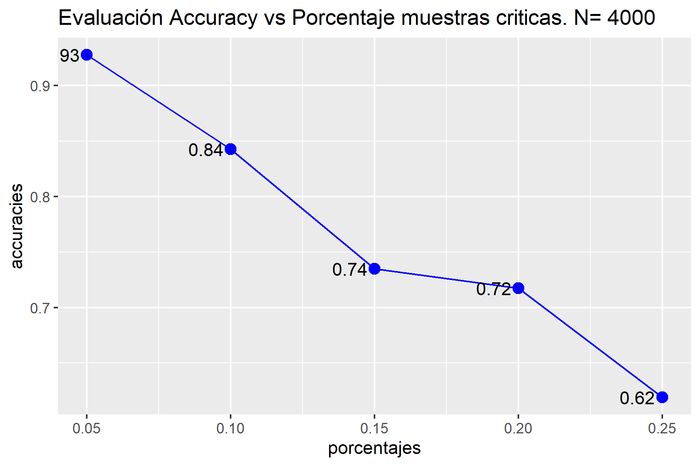

# Mejora modelo clasificación de vulnerabilidades
## Text análisis y modificación del dataset
### Obtención de los datos

La extracción de datos se hace a través de un fichero XML donde cada observación está compuesta por varias columnas de las cuales solamente se usaran el Qid ("Identificador de la vulnerabilidad), Severity (nivel de gravedad de la vulnerabilidad)
y Diagnosis (Diagnóstico asociado a la vulnerabilidad).

En la generación del dataset se crea una columna nueva:

- Crítica: Valor Boleano, clasifica la muestra como crítica en caso de que la severity sea 5.


```{r library, include=FALSE}
library(dplyr)
library(tm)
library(caret)
library(ggplot2)
library(kableExtra)
```

```{r Data, include=FALSE}
raw.file = "../../data/qualys/latest.qkdb.xml.zip"
doc <- xml2::read_xml(raw.file)

# Extract QID, SEVERITY_LEVEL and DIAGNOSIS
kdb_txt <- rvest::html_text(rvest::html_elements(doc, xpath="//VULN[DIAGNOSIS]/*[self::QID or self::SEVERITY_LEVEL or self::DIAGNOSIS]"))
kdb_txt <- matrix(kdb_txt, nrow = length(kdb_txt)/3, ncol = 3, byrow = TRUE)
kdb_txt <- as.data.frame.matrix(kdb_txt)
names(kdb_txt) <- c("qid", "severity", "diagnosis")

# Tidy data frame
kdb_txt$qid <- as.integer(kdb_txt$qid)
kdb_txt$severity <- as.integer(kdb_txt$severity)
kdb_txt$diagnosis <- textclean::replace_html(kdb_txt$diagnosis)
kdb_txt$critical <- ifelse(test = kdb_txt$severity < 5, yes = "NO", no = "YES")
kdb_txt$criticalb <- kdb_txt$severity == 5
```

```{r Taula , echo=FALSE}
kable(head(kdb_txt)) %>% kable_styling()
```

### Text Analysis

Se realiza el análisis de frecuencia de palabres y caracteres en el dataset. La clasifican las palabras de la columna diagnosis y se analiza la freuqencia cada una de ellas.
Se destaca la importancia de eliminar las palabras que no tienen mucho valor semantico como pueden ser: signos de puntuación, preposiciones, articulos, etc. 

```{r Text, include=FALSE}

freq_word <- sort(table(unlist(strsplit(kdb_txt$diagnosis, " "))), decreasing = TRUE)
kdb_words <- names(freq_word)[(which(!(names(freq_word) %in% stopwords::stopwords())))]
## Characters
freq_char <- sort(table(unlist(strsplit(kdb_txt$diagnosis, ""))), decreasing = TRUE)

kdb_txt$descr <- textclean::replace_symbol(kdb_txt$diagnosis)
freq_char2 <- sort(table(unlist(strsplit(kdb_txt$descr, ""))), decreasing = TRUE)
freq_char2

# Prepare data for training
kdb_critical <- kdb_txt %>% filter(critical == "YES")
kdb_other <- kdb_txt %>% filter(critical == "NO")

```

### Optimización del texto extraido

El modelo principalmente consiste en encontrar las palabras que más se repiten dentro del campo diagnosis de la base de datos de Qualys, desde el que vamos a intentar predecir si la vulnerabilidad se puede considerar crítica o no, solamente leyendo dicho parámetro.
Para hacerlo, el modelo encuentra las palabras con mayor frecuencia dentro del campo nombrado anteriormente y aprende sobre ellas. Este hecho nos lleva a pensar que si intentamos normalizar las palabras dentro del propio campo, se puedan conseguir mayores resultados.

Se ha intentado normalizar todas las palabras que se han encontrado parecidas, pero el modelo solo mejora sus resultados con la normalización de todos los códigos CVE. Mejora del 1% de accuracy.

Quizás uno de los métodos que se podría usar sería la implementación de un modelo K-means para clusterizar el máximo de palabras posibles de forma dinámica.

```{r norma, include=FALSE}

total <- 12000
porcentaje <- 0.05

kdb_ml <- bind_rows(kdb_critical %>% sample_n(porcentaje*total),
                    kdb_other %>% sample_n((1-porcentaje)*total)) %>%
  sample_n(total) %>%
  select(descr, critical)

#*******************************************************************
#                         Classification
#*******************************************************************
# install.packages("tm")
#-------------------------------------------------------------------
#                  4.2.: Preparing data for Classification
#-------------------------------------------------------------------
#Load up the corpus
# course_raw = scan("data/Course-Descriptions.txt", what="", sep="\n")
course_raw <- kdb_ml$descr
course_corpus <- VCorpus(VectorSource(course_raw))
inspect(course_corpus[[1]])
#Convert to lower case
course_corpus2 <- tm_map(course_corpus, content_transformer(tolower))
#Remove punctuations
course_corpus3 <- tm_map(course_corpus2, removePunctuation)
#Remove stopwords
course_corpus4 <- tm_map(course_corpus3, removeWords, stopwords())
#inspect(course_corpus4[[1]])
#Creamos una función para reemplazar palabras
remplazo_palabras <- function(x,palabra_buscar, palabra_reemplazar){
  gsub(palabra_buscar,palabra_reemplazar,x)
}
#Creamos una función para reemplazar palabras con Expresion Regular
remplazo_palabras_re <- function(x,expresion_regular, palabra_reemplazar){
  gsub(expresion_regular,palabra_reemplazar,x, perl = TRUE)
}
  
#Cambiamos Users por user
#course_corpus5 <- tm_map(course_corpus4, content_transformer(remplazo_palabras),palabra_buscar="users",palabra_reemplazar="user")
#Cambiamos vulnerabilities por vulnerability
#course_corpus6 <- tm_map(course_corpus5, content_transformer(remplazo_palabras),palabra_buscar="vulnerabilities",palabra_reemplazar="vulnerability")
#Cambiamos versions por version
#course_corpus7 <- tm_map(course_corpus6, content_transformer(remplazo_palabras),palabra_buscar="versions",palabra_reemplazar="version")
#Cambiamos compromised por compromise
#course_corpus8 <- tm_map(course_corpus7, content_transformer(remplazo_palabras),palabra_buscar="compromised",palabra_reemplazar="compromise")
#Cambiamos corrupted por corrupt
#course_corpus9 <- tm_map(course_corpus8, content_transformer(remplazo_palabras),palabra_buscar="corrupted",palabra_reemplazar="corrupt")
#Cambiamos corruption por corrupt
#course_corpus10 <- tm_map(course_corpus9, content_transformer(remplazo_palabras),palabra_buscar="corruption",palabra_reemplazar="corrupt")
#Aplicamos expresion regular a las palabras "authenticate", "authenticated", "authenticating", "authentication" y las agrupamos a authenticate
#course_corpus11 <- tm_map(course_corpus10, content_transformer(remplazo_palabras_re),expresion_regular="\\bauthentic\\w*\\b",palabra_reemplazar="authenticate")
#Automatically, Automation, Automatic
#course_corpus12 <- tm_map(course_corpus11, content_transformer(remplazo_palabras_re),expresion_regular="\\bautomati\\w*\\b",palabra_reemplazar="automatic")
#Cambiamos systems por system
#course_corpus14 <- tm_map(course_corpus13, content_transformer(remplazo_palabras),palabra_buscar="systems",palabra_reemplazar="system")
#Cambiamos issues por issue
#course_corpus15 <- tm_map(course_corpus14, content_transformer(remplazo_palabras),palabra_buscar="issues",palabra_reemplazar="issue")
#Cambiamos fixes por fix
#course_corpus16 <- tm_map(course_corpus15, content_transformer(remplazo_palabras),palabra_buscar="fixes",palabra_reemplazar="fix")
#Cambiamos files por file
#course_corpus17 <- tm_map(course_corpus16, content_transformer(remplazo_palabras),palabra_buscar="files",palabra_reemplazar="file")
#No interesa un CVE especifico sino simplemente que esta asociado a un CVE.
course_corpus5 <- tm_map(course_corpus4, content_transformer(remplazo_palabras_re),expresion_regular="\\bcve\\w*\\b",palabra_reemplazar="cve_id")
#Generate TF-IDF matrix
course_dtm <- DocumentTermMatrix(course_corpus5)
findFreqTerms(course_dtm,5)
#Remove terms not in 90% of the documents. Only have those that are there
#in atleast 10% documents
dense_course_dtm <- removeSparseTerms(course_dtm, .85)
#Inspect to TF-IDF
inspect(dense_course_dtm)
#Convert continuous values to classes = { Yes, No }
conv_counts <- function(x) {
  x <- ifelse(x > 0, 1, 0)
  x <- factor(x, levels = c(0, 1), labels = c("No", "Yes"))
}
class_dtm <- apply(dense_course_dtm, MARGIN = 2, conv_counts)
```

## Busqueda de los mejores parametros de entreno.
### Porcentaje de muestras críticas

El objetivo de este punto es evaluar el % de muestras críticas a usar a la hora de entrenar el modelo.
Observando la base de datos de Qualys nos damos cuenta de que existen muchas más vulnerabilidades definidas como no críticas que aquellas definidas como críticas. Por lo que seguramente el porcentaje de muestras críticas usadas para el entreno debe ser menor al de no críticas.

Otro valor a determinar es el número de muestras que se utiliza para entrenar el modelo. Con el fin de determinar la mejor combinación de ambos valores se realizarán varios gráficos de Accuracy-Porcentaje de muestras críticas para determinar el mejor porcentaje con el cual se obtiene una mejor accuracy para cada número de muestras.

La primera prueba que se ha realizado, contiene un número total de muestras de entrenamiento igual a 4000. Se han evaluado los porcentajes 5%, 10%, 20%, 30%, 40% y 50% de muestras críticas.

```{r porcen, include=FALSE, echo=FALSE}
total <- 4000
porcentajes <- c(0.05, 0.1, 0.15, 0.2, 0.3, 0.4, 0.5)
accuracies <- numeric()
for (x in porcentajes){
  
  print(x*total)
  print((1-x)*total)
  
  kdb_ml <- bind_rows(kdb_critical %>% sample_n(x*total),
                      kdb_other %>% sample_n((1-x)*total)) %>%
    sample_n(total) %>%
    select(descr, critical)
  
  
  #*******************************************************************
  #                         Classification
  #*******************************************************************
  # install.packages("tm")
  #-------------------------------------------------------------------
  #                  4.2.: Preparing data for Classification
  #-------------------------------------------------------------------
  #Load up the corpus
  # course_raw = scan("data/Course-Descriptions.txt", what="", sep="\n")
  course_raw <- kdb_ml$descr
  course_corpus <- VCorpus(VectorSource(course_raw))
  inspect(course_corpus[[1]])
  #Convert to lower case
  course_corpus2 <- tm_map(course_corpus, content_transformer(tolower))
  #Remove punctuations
  course_corpus3 <- tm_map(course_corpus2, removePunctuation)
  #Remove stopwords
  course_corpus4 <- tm_map(course_corpus3, removeWords, stopwords())
  
  #Creamos una función para reemplazar palabras con Expresion Regular
  remplazo_palabras_re <- function(x,expresion_regular, palabra_reemplazar){
    gsub(expresion_regular,palabra_reemplazar,x, perl = TRUE)
  }
  
  #No interesa un CVE especifico sino simplemente que esta asociado a un CVE.
  course_corpus5 <- tm_map(course_corpus4, content_transformer(remplazo_palabras_re),expresion_regular="\\bcve\\w*\\b",palabra_reemplazar="cve_id")
  
  
  #Generate TF-IDF matrix
  course_dtm <- DocumentTermMatrix(course_corpus4)
  
  findFreqTerms(course_dtm,5)
  #Remove terms not in 90% of the documents. Only have those that are there
  #in atleast 2 documents
  dense_course_dtm <- removeSparseTerms(course_dtm, .85)
  #Inspect to TF-IDF
  
  #Convert continuous values to classes = { Yes, No }
  conv_counts <- function(x) {
    x <- ifelse(x > 0, 1, 0)
    x <- factor(x, levels = c(0, 1), labels = c("No", "Yes"))
  }
  class_dtm <- apply(dense_course_dtm, MARGIN = 2, conv_counts)
  
  #-------------------------------------------------------------------
  #                  4.3.: Building the model
  #-------------------------------------------------------------------
  #Load the classifications for the descriptions
  # course_classes = scan("data/Course-Classification.txt", what="", sep="\n")
  course_classes <- kdb_ml$critical
  #install.packages("caret")
  #Random split of training and testing sets
  train_set <- createDataPartition(y=course_classes, p=.7,list=FALSE)
  #spliting the dtm
  train_dtm <- class_dtm[train_set,]
  test_dtm <-class_dtm[-train_set,]
  #split the course_classes
  train_classes <- course_classes[train_set]
  test_classes <- course_classes[-train_set]
  #train the model using naive bayes
  course_model <- train( data.frame(train_dtm), train_classes, method="nb")
  
  #-------------------------------------------------------------------
  #                  4.3.: Predictions for Text
  #-------------------------------------------------------------------
  #Predict for the test data
  course_predictions <- predict(course_model,test_dtm)
  #Analyze prediction accuracy
  confusionMatrix(table(course_predictions , test_classes))
  #-------------------------------------------------------------------
  accuracies <- c(accuracies, confusionMatrix(table(course_predictions , test_classes))$overall["Accuracy"])
}
```

```{r plot,echo=FALSE}
plot(porcentajes, accuracies, col = "blue", type="o")
lines(porcentajes,accuracies)
title("Evaluación Accuracy vs Porcentaje muestras criticas")
```

Los resultados obtenidos son muy significativos. Tal y como se observa, si usamos un porcentaje menor de muestras críticas, los resultados mejoran. Cabe destacar que el mejor resultado obtenido es con el 5% de muestras críticas. Cuando se entrena el modelo con un 5% de muestras críticas y un 95% de muestras no críticas, se obtiene un accuracy del 92% aproximadamente. Este hecho se debe a que estamos entrenando al modelo a poder determinar de forma muy correcta todas aquellas muestras que NO son críticas, y por consecuencia, puede determinar las que sí que lo son.

### Número total de muestras

Con los resultados anteriores, los valores que se evaluarán de porcentaje a partir de ahora serán (5%, 10%, 15%, 20% y 25%). A continuación podemos observar todos los gráficos que se han obtenido evaluando el número total de muestras igual a 2000, 4000, 6000, 8000, 10000, 12000, 14000 y 16000.

Cabe destacar que el número máximo de muestras usado para entrenar es 16000 porque la base de datos solamente contiene 4500 muestras críticas y hay que guardar algunas para la parte de test.


  


Estos gráficos se pueden generar con el fichero TamañoMuestras.R.

## Analisis Resultados Obtenidos

Observando los gráficos anteriores, aunque todos los resultados son bastante parecidos cuando se usa un 5% de muestras críticas (porcentaje con el que se obtiene mejor accuracy), se considera que el número ideal de muestras total con las que entrenar el modelo es, 12000. Con estos parámetros se obtiene un accuracy del 94%.

### Parametros del modelo obtenidos

```{r Parametros, include=FALSE, echo=FALSE}
total <- 12000
porcentaje <- 0.05

kdb_ml <- bind_rows(kdb_critical %>% sample_n(porcentaje*total),
                    kdb_other %>% sample_n((1-porcentaje)*total)) %>%
  sample_n(total) %>%
  select(descr, critical)


#*******************************************************************
#                         Classification
#*******************************************************************
# install.packages("tm")
#-------------------------------------------------------------------
#                  4.2.: Preparing data for Classification
#-------------------------------------------------------------------
#Load up the corpus
# course_raw = scan("data/Course-Descriptions.txt", what="", sep="\n")
course_raw <- kdb_ml$descr
course_corpus <- VCorpus(VectorSource(course_raw))
inspect(course_corpus[[1]])
#Convert to lower case
course_corpus2 <- tm_map(course_corpus, content_transformer(tolower))
#Remove punctuations
course_corpus3 <- tm_map(course_corpus2, removePunctuation)
#Remove stopwords
course_corpus4 <- tm_map(course_corpus3, removeWords, stopwords())

#Creamos una función para reemplazar palabras con Expresion Regular
remplazo_palabras_re <- function(x,expresion_regular, palabra_reemplazar){
  gsub(expresion_regular,palabra_reemplazar,x, perl = TRUE)
}

#No interesa un CVE especifico sino simplemente que esta asociado a un CVE.
course_corpus5 <- tm_map(course_corpus4, content_transformer(remplazo_palabras_re),expresion_regular="\\bcve\\w*\\b",palabra_reemplazar="cve_id")


#Generate TF-IDF matrix
course_dtm <- DocumentTermMatrix(course_corpus4)

findFreqTerms(course_dtm,5)
#Remove terms not in 90% of the documents. Only have those that are there
#in atleast 2 documents
dense_course_dtm <- removeSparseTerms(course_dtm, .85)
#Inspect to TF-IDF

#Convert continuous values to classes = { Yes, No }
conv_counts <- function(x) {
  x <- ifelse(x > 0, 1, 0)
  x <- factor(x, levels = c(0, 1), labels = c("No", "Yes"))
}
class_dtm <- apply(dense_course_dtm, MARGIN = 2, conv_counts)

#-------------------------------------------------------------------
#                  4.3.: Building the model
#-------------------------------------------------------------------
#Load the classifications for the descriptions
# course_classes = scan("data/Course-Classification.txt", what="", sep="\n")
course_classes <- kdb_ml$critical
#install.packages("caret")
#Random split of training and testing sets
train_set <- createDataPartition(y=course_classes, p=.7,list=FALSE)
#spliting the dtm
train_dtm <- class_dtm[train_set,]
test_dtm <-class_dtm[-train_set,]
#split the course_classes
train_classes <- course_classes[train_set]
test_classes <- course_classes[-train_set]
#train the model using naive bayes
course_model <- train( data.frame(train_dtm), train_classes, method="nb")

#-------------------------------------------------------------------
#                  4.3.: Predictions for Text
#-------------------------------------------------------------------
#Predict for the test data
course_predictions <- predict(course_model,test_dtm)

# Guardar la salida de la función confusionMatrix() en una variable
cm <- confusionMatrix(table(course_predictions, test_classes))

# Extraer los valores de la matriz de confusión
# Guardar la salida de la función confusionMatrix() en una variable

```

```{r Printparametros, echo=FALSE}

cat("Accuracy: ", cm$overall["Accuracy"])
cat("Sensitivity: ", cm$byClass["Sensitivity"])
cat("Precisión: ", cm$byClass["Pos Pred Value"])

```

Se ha realizado este estudio en la buscada de la mejor accuracy posible ya que es el parámetro por excelencia que define el comportamiento del modelo. Aun así, se ha considerado oportunos la obtención de los siguientes parámetros:

- Sensibilidad: también conocida como tasa de verdaderos positivos (TPR), es una medida de qué tan bien el modelo identifica las instancias positivas. Se define como la proporción de verdaderos positivos respecto al total de instancias positivas en el conjunto de datos. En otras palabras, mide la capacidad del modelo para detectar correctamente los casos positivos. 

- Precisión: es una medida de qué tan bien el modelo predice correctamente las instancias positivas. Se define como la proporción de verdaderos positivos respecto al total de instancias clasificadas como positivas por el modelo. En otras palabras, mide la probabilidad de que una instancia clasificada como positiva por el modelo sea realmente positiva. 

En resumen, la sensibilidad mide la capacidad del modelo para identificar correctamente los casos positivos, mientras que el valor de precisión mide la capacidad de predecir del modelo respecto los casos positivos. Ambas medidas son importantes para evaluar la calidad general de un modelo de clasificación.

## Conclusiones

En este proyecto se ha llevado a cabo un análisis exploratorio de datos y un modelo de clasificación para la identificación de descripciones críticas en el contexto de una base de datos de vulnerabilidades conocidas.

En primer lugar, se realizó un análisis exploratorio de los datos para entender mejor las características de las descripciones críticas y no críticas. Se encontraron diferencias significativas entre los dos grupos, destacando la presencia de ciertos términos específicos en las descripciones críticas.

Posteriormente, se aplicó un modelo de clasificación basado en Naive Bayes para predecir si una descripción es crítica o no. Se realizó una búsqueda de los hiperparámetros óptimos para el modelo, obteniendo una precisión del 94%. Además, se evaluó el modelo utilizando otras métricas como la sensibilidad y la precisión, lo que nos permite tener una comprensión más completa de la calidad del modelo.

En general, los resultados sugieren que es posible identificar las descripciones críticas en la base de datos de vulnerabilidades conocidas utilizando técnicas de aprendizaje automático. Este enfoque podría tener aplicaciones prácticas en la detección y prevención de vulnerabilidades en sistemas informáticos.

Sin embargo, es importante destacar que este modelo se basó en una base de datos de vulnerabilidades conocidas y puede no ser aplicable a otras situaciones en las que las vulnerabilidades son desconocidas o se presentan de manera diferente. Además, es necesario tener en cuenta que el modelo se basa en un enfoque supervisado y, por lo tanto, requiere datos etiquetados para entrenar el modelo.

En conclusión, el trabajo realizado demuestra la viabilidad de la utilización de técnicas de aprendizaje automático en la identificación de descripciones críticas en una base de datos de vulnerabilidades conocidas. Sin embargo, se necesita más investigación para evaluar su aplicabilidad en otros contextos y para desarrollar modelos más robustos y precisos en la detección de vulnerabilidades en sistemas informáticos.


